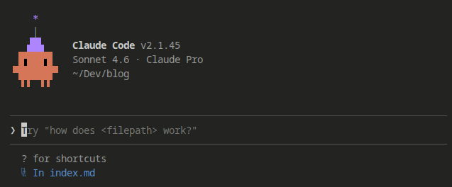
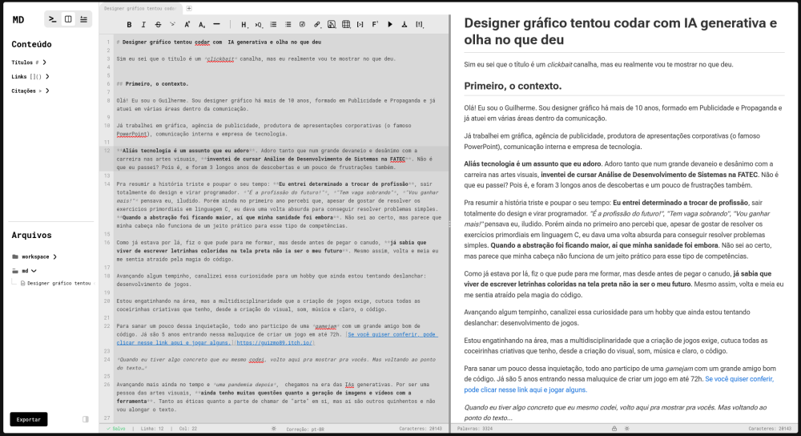

Sim eu sei que o título é um *clickbait* canalha, mas eu realmente vou te mostrar no que deu.

## Primeiro, o contexto.

Olá! Eu sou o Guilherme. Sou designer gráfico há mais de 10 anos, formado em Publicidade e Propaganda e já atuei em várias áreas dentro da comunicação. 

[Já trabalhei em gráfica, agência de publicidade, produtora de apresentações corporativas (o famoso PowerPoint), campanha política, comunicação interna e empresa de tecnologia.](https://www.behance.net/gui_silva)

**Aliás tecnologia é um assunto que eu adoro**. Adoro tanto que num grande devaneio e desânimo com a carreira nas artes visuais, **inventei de cursar Análise de Desenvolvimento de Sistemas na FATEC**. Não é que eu passei? Pois é, e foram 3 longos anos de descobertas e um pouco de frustrações também.

Pra resumir a história triste e poupar o seu tempo: **Eu entrei determinado a trocar de profissão**, sair totalmente do design e virar programador. *"É a profissão do futuro!"*, *"Tem vaga sobrando"*, *"Vou ganhar mais!"* pensava eu, iludido. Porém ainda no primeiro ano percebi que, apesar de gostar de resolver os exercícios primordiais em linguagem C, eu dava uma volta absurda para conseguir resolver problemas simples. **Quando a abstração foi ficando maior, aí que minha sanidade foi embora**. Não sei ao certo, mas parece que minha cabeça não funciona de um jeito prático para esse tipo de competências.

Como já estava por lá, fiz o que pude para me formar, mas desde antes de pegar o canudo, **já sabia que viver de escrever letrinhas coloridas na tela preta não ia ser o meu futuro**. Mesmo assim, volta e meia eu me sentia atraído pela magia do código.

Avançando algum tempinho, canalizei essa curiosidade para um hobby que ainda estou tentando deslanchar: desenvolvimento de jogos.

Estou engatinhando na área, mas a multidisciplinaridade que a criação de jogos exige, cutuca todas as coceirinhas criativas que tenho, desde a criação do visual, som, música e claro, o código.

Para sanar um pouco dessa inquietação, todo ano participo de uma *gamejam* com um grande amigo bom de código. Já são 5 anos entrando nessa maluquice de criar um jogo em até 72h. [Se você quiser conferir, pode clicar nesse link aqui e jogar alguns.](https://guizmo89.itch.io/)

*Quando eu tiver algo concreto que eu mesmo codei, volto aqui pra mostrar pra vocês. Mas voltando ao ponto do texto…*

Avançando mais ainda no tempo e *uma pandemia depois*,  chegamos na era das IAs generativas. Por ser uma pessoa das artes visuais, **ainda tenho muitas questões quanto a geração de imagens e vídeos com a ferramenta**. Tanto as éticas quanto a parte de chamar de "arte" em si, mas aí são outros quinhentos e não vou alongar o texto. 

O que realmente encheu meus olhos foi a possibilidade de executar **o controverso, odiado por uns e amado por outros, ato do *vibe coding***. Programar só "conversando" com a máquina? Me pareceu tentador.

**Não sei vocês, mas minha cabeça não para nunca**. Seja remoendo caraminholas do passado ou viajando em fantasias e ideias novas, eu estou sempre pensando em alguma coisa. E nessa de ter muitas ideias, eventualmente eu anoto coisas em meu app de notas pessoais.

Isso fez com que ao longo do tempo eu **acumulasse várias coisinhas que tinha vontade de executar, mas não tinha o conhecimento técnico para tal**. E algumas dessas coisinhas necessariamente envolviam código, então ou eu achava alguém pra executar comigo, ou ia ficar só no campo das ideias pra sempre.

Nessa que entra o meu recente parceiro virtual: **Claude Code**.

No fim do ano passado, a Anthropic — empresa que faz o Claude — fez uma promoção com um descontão na assinatura por 3 meses e resolvi embarcar no *hype* para tentar executar alguma coisa.

## Botando ideias em prática

Tá bom, eu confesso, eu já tive uma experiência prévia com IA e código. Mas foi coisa pouca, eu prometo. 

Eu possuo um Raspiberry Pi 4, que uso como "console" para emular jogos antigos *(tudo legalizado, graças a Deus)*. Ano passado fui atualizar o sistema operacional e isso iria demandar a formatação do cartão SD dele, **o que faria eu perder todos os *save games* de jogos que tenho lá**. Como estava de bobeira, pedi pro Claude criar um scriptzinho de terminal para automatizar o backup dos saves dos jogos. Em pouco mais de 1 hora eu consegui o que queria, rodando direitinho. Dei umas emperiquitadas, colocando seleção de idiomas e tudo mais e publiquei no meu Github. **Tem pra [Linux](https://github.com/guizmo-silva/recalbox-saves-backup-linux) e pra [Windows](https://github.com/guizmo-silva/recalbox-saves-backup-windows) até.**

**Desde então fiquei maravilhado com as possibilidades.**

Voltando para o presente, queria executar uma ideia que me permitisse treinar um pouco de UI, UX(pra tirar a ferrugem do Figma) e que tivesse **um grau de complexidade mais elevado**, para sentir como é o *workflow* com o Claude.

Como recentemente eu havia precisado escrever algumas coisas usando Markdown e, depois de muita procura, **não tinha achado nenhum editor que fosse exatamente o que eu queria**, decidi tentar criar o meu próprio appzinho de textos em .md.

*E inclusive é nele que estou escrevendo esse texto e configurei esse blog que você está lendo agora.*

> *"Ah Gui, mas se você queria criar um blog não poderia ter só aberto o Word ou Google Docs, escrito tudo e depois postado no Medium?"*

Poder, podia. Mas que graça teria né? ¯\\\_(ツ)_/¯

## A ideia

Uma coisa que eu procurei em outros editores de linguagem Markdown e não achei, **foi a possibilidade de navegar entre os diversos elementos escritos**. Explico.

Quem já precisou escrever qualquer documento grande em MD — ou qualquer tipo de texto no geral — sabe que é muito comum no processo de escrita e revisão você ficar lendo e relendo trechos diferentes, indo e voltando nos parágrafos para conferir informações. 

**Eu queria uma aplicação que tivesse uma interface simples para poder visualizar onde estavam todos os títulos, todos os links, imagens, bullet points e tudo mais que fosse relevante**. Então comecei a engenhar uma interface com foco em uma barra lateral que me permitisse fácil acesso a esses elementos.

**A inspiração mais óbvia é o VSCode**. Acredito que dá pra ver as similaridades. Tanto que também incluí um explorador de arquivos logo abaixo, que mostra todos os documentos que você está trabalhando. Com direito a hierarquia de pastas e tudo mais.

A intenção é que também fosse possível trabalhar em vários documentos ao mesmo tempo, então pensei em uma barra de abas, para abrigar tudo que estivesse aberto.

E na parte do editor, segui o feijão com arroz, com tela dividida sendo a da esquerda a visão do código e a da direita a visão do texto formatado. Com a possibilidade de alternar entre uma ou outra ou deixar a tela dividida mesmo. 

## A preparação

O intuito aqui, além de contar como foi minha experiência também é dar algumas dicas baseadas no que aprendi e estou aprendendo nesse processo. Para quem já *coda* provavelmente vai ser tudo meio óbvio, **mas pra quem não é do ramo e pretende ou já usa IA generativa com código, acredito que as dicas possam ajudar no seu processo**.

Aliás, como eu confessei antes que já tinha tido uma pequena experiência com o Claude Code, acho que também vale lembrar que, como citei no começo do texto, **apesar de ter sido na força do ódio**, eu **me formei** em análise e desenvolvimento de sistemas. Então por mais inútil que eu seja pra escrever código sozinho, **ainda assim tenho um pouco do conhecimento inerente à área**. O quê, vendo agora, foi de grande serventia para resolução de problemas.

Acredito que vale citar também que fiz tudo isso usando *Linux*. Sempre adorei o sistema do pinguim e usei a situação como desculpa para deixá-lo como meu *SO* primário.

Então antes de simplesmente abrir o VSCode, puxar um terminal, chamar o Claude e começar a teclar minhas ideias. **Primeiro eu fui no Claude Web, e troquei uma ideia sobre o que eu queria. Fazendo isso pude estabelecer as tecnologias que seriam usadas e o workflow ideal.**

**Minha intensão inicial era fazer uma aplicação que rodasse em [Docker](https://pt.wikipedia.org/wiki/Docker_(software))**. Ultimamente estou sendo um entusiasta da *autohospedagem*, tenho um computadorzinho rodando o sistema ZimaOS. Nele tenho alguns programas para gerenciar a minha — *também totalmente legalizada* — biblioteca de filmes e séries. Assim como também faço backup de alguns arquivos do meu PC. Explicando de forma absurdamente resumida, o Zima cria uma maneira fácil de usar o Docker, rodando em cima de um Ubuntu Server modificado. Você faz (praticamente) tudo por interface visual, sem precisar dar comandos em terminal.

Além de poder instalar *apps* (containers de Docker) pela loja oficial da empresa, **você também pode adicionar aplicações de fora. Portanto minha intenção era colocar meu humilde editor de textos nele e poder acessá-lo de qualquer computador dentro da minha casa.**

Conversando com o Claude sobre a ideia, ele me deu a sugestão de usar React (com Typescript) e Next.js para o frontend e Node.js (também com Typescript) e Express para o backend. Assim, caso eu quisesse fazer uma versão *desktop* depois, seria simples de adaptar.

Decididas as tecnologias **pedi pra ele me ajudar a *setar* o ambiente de trabalho, instalando os módulos e dependências necessárias**. Claro que eu poderia ter pedido para o Claude Code fazer tudo isso, mas eu não queria ficar totalmente "cego" quanto ao processo de desenvolvimento. Obviamente eu não entendo dos pormenores do código ou implementações do programa, mas minha intenção também era aprender sobre o processo e **ao menos ter o *big picture* de como o meu próprio app funciona.**

**E aqui vai mais uma dica**: como mencionei antes, estou usando o plano mais básico do Claude, portanto minha janela de uso não é das maiores, principalmente quando necessito fazer grandes alterações. Então percebi que uma boa forma de economizar um pouco de tokens é você mesmo dar alguns comandos ao invés de pedir tudo para a IA.

Além disso, outra coisa que é útil de aprender e que vai te economizar um pouquinho de uso do plano é [git](https://pt.wikipedia.org/wiki/Git), o famoso sistema de gerenciamento de arquivos. Não precisa ser um especialista completo, mas saber como configurar o repositório remoto, adicionar as alterações no stage, commitar e dar push já vão te poupar uma boa porcentagem de uso sem necessidade. Claro que as vezes acontece algum erro que não entendo, mesmo pesquisando, e aí recorro ao meu sabe-tudo virtual para corrigir, mas na maioria das vezes tenho me virado "na mão".

## O setup

**Primeiro fui no Figma e rascunhei uma versão da interface que tinha em minha cabeça**. Fiz tudo por lá, incluindo até os ícones (que ainda estão meio feiozos, eu sei. Mas depois eu arrumo). Tentei seguir os padrões corretos de design na ferramenta, utilizando os quadros pra tudo e agrupando os elementos da maneira mais racional possível.

Exportei os ícones como svg, uma imagem geral da interface e algumas outras imagens de elementos específicos para o Claude conseguir ter uma boa ideia do que eu queria. 

Depois, voltei na conversa técnica que tive com ele **e pedi para me gerar um documento .md que seria o norte para o Claude Code começar o desenvolvimento**.

Quem já mexeu com o Claudinho sabe que quando você começa um projeto é possível criar um arquivo chamado CLAUDE.md que vai ser o norte para a ferramenta, toda vez que uma sessão é iniciada.

**E aqui cabe outra dica:** lendo alguns artigos sobre otimização do uso, vi várias pessoas comentando como ter um CLAUDE.md enxuto ajuda a economizar *tokens*.

O arquivo que a versão web gerou pra mim sobre nossa conversa estava bem completo, **porém muito redundante e prolixo**. Precisei dar uma resumida e deixei apenas os principais pontos que tinham a ver o desenvolvimento em si.

Outro documento que criei foi um arquivo específico sobre design. Dentro do projeto criei uma pasta só para os *assets* que eu exportei e incluí esse arquivo. Nele adicionei cores que utilizei, o endereço do repositório do Figma (você vai precisar configurar o MCP do Claude para acessar o Figma na web) e também coloquei o nome de cada imagem da interface, descrevendo sobre o que era e o que prestar atenção.

**Após todo esse setup**, finalmente abri o terminal, chamei o Claude Code, mandei ele ler o CLAUDE.md e dar início ao desenvolvimento.

## O processo

Após toda essa preparação, o Claude começou a por a mão na massa e preparar todo o terreno. Baixou as dependências e bibliotecas, configurou as pastas e deixou o terreno capinado para começar a construção.

**Aqui também cabe outra dica de otimização:** assim como saber comandos *git* ajuda a agilizar o processo e economizar tokens, saber alguns comandos básicos de terminal também é extremamente útil. Não é nenhum bicho de sete cabeças aprender a navegar entre pastas, criar, apagar e copiar documentos tudo via linha de comando. As vezes será necessário e se souber fazer na mão, vai te deixar mais no controle ainda.

Também é legal ter uma ideia sobre comandos no geral pois o próprio Claude Code vai dar inúmeros deles no terminal. Na maioria das vezes ele vai te perguntar se pode executar e você pode escolher se sim, sim para todos os outros comandos parecidos ou não poder. E aqui cabe um ponto de atenção. 

Apesar dele fazer e falar tudo com a maior confiança do mundo, você tem sempre que ter em mente que **a IA pode errar e alucinar**. Por isso é extremamente importante saber que se ele quiser mandar um `rm -rf /` você não pode simplesmente sair dando OK sem saber que ele está prestes a apagar o seu sistema todo.

Com as devidas precauções tomadas, comecei a pedir para ele ir construindo a aplicação, parte por parte. 

Primeiro começamos com a parte do editor de código. Depois colocamos a visualização do texto renderizado e então implementamos a barra lateral.

Eu sei que eu devia ter feito a lição de casa e montado um plano mais elaborado de desenvolvimento, ou no mínimo um quadro *kanban* para ir monitorando as implementações, mas acabei me deixando ir (com o perdão da piada) pela *vibe*.

Pra não dizer que não anotei nada, tudo que ia modificando e implementando ia ficando documentado nos commits, assim como também peguei o costume de sempre anotar um *TODO* (o famoso "Tchudhu") neles, com o que ainda faltava a ser feito.

Antes de testar a versão de docker localmente, comecei rodando direto. E para economizar alguns preciosos tokens, aprendi a abrir um novo terminal, navegar até a pasta do front e do backend e mandar um `npm run dev` para ver a aplicação rodando no navegador.

Após algumas iterações, o projeto foi ficando com a cara que queria. Também é engraçado perceber como muitas ideias só vem quando vemos a coisa funcionando em nossa frente. 

Conforme ia testando, ia tendo mais e mais ideias de coisas para colocar, mas se uma coisa que a faculdade e a vivência com profissionais de tecnologia me ensinou, foi a me ater aos planos e não viajar na maionese. 

Minha intenção era criar um editor de textos, não era? Então vamos fazer um editor de textos. Foi o que eu botei na minha cabeça para conseguir terminar o que estava fazendo e conseguir publicar ao menos uma v1 satisfatória. Faça funcionar, melhore depois.

Com as principais funcionalidades rodando, botei a versão de docker pra testar em minha máquina. Mais alguns ajustes aqui e ali e então subi para o repositório no Github. O Claude ajustou um workflow para mim e agora é só dar *push* que o Github Actions deixa a imagem no ar para poder testar.

E aqui estou eu, digitando este texto utilizando meu próprio editor de textos, rodando em meu servidor pessoal. E inclusive, até demorei para escrever tudo pois a cada sessão de escrita eu ia anotando bugs e melhorias e ao final do dia, ia implementando as correções e dando push nas alterações. *As vezes é legal viver no futuro*.

## Lições aprendidas

Como todo bom texto de Linkedin, eu preciso ter alguns parágrafos aqui para mostrar o quão evoluído e autocentrado sou, e o que de bom tirei dessa experiência… Então vamos lá.

#### CONHECIMENTO PRÉVIO EM PROGRAMAÇÃO É ESSENCIAL

Tenho certeza de que minha experiência até agora só foi enriquecedora e divertida porque **eu possuo um pouco de intimidade com o desenvolvimento de software**. Se fosse um completo leigo, provavelmente até teria alguma coisa rodando, mas certamente não estaria tão polido e isso teria custado muitos dos poucos cabelos que ainda me restam na careca. 

Começar a desenvolver um programa no puro achismo e boa intenção, sem ter nenhuma base teórica ou técnica achando que a IA vai te dar tudo na boquinha certamente não vai resultar num produto minimamente usável.

#### SABER SE EXPRESSAR

Esse é um tópico que já vi várias das pessoas mais reticentes quanto ao uso da IA baterem na tecla. Se você não escreve bem e não detalha exatamente o que quer, o seu ajudante virtual não vai fazer milagre. 

Aqui o ser humano ganha de lavada. Nós entendemos contexto, intensidade da fala, nuances, gestos, expressões faciais e tonalidade de voz. Tudo quer dizer alguma coisa. Com a IA, você só tem esses poucos caracteres do teclado para tentar dialogar.

**Então uma escrita limpa, precisa e muitas vezes boa de descrição é extremamente necessária**. Várias vezes começava a digitar algo no terminal e no meio da frase me tocava de que estava escrevendo como se o Claude soubesse todo o contexto do que eu tinha pensado antes de começar a teclar. Quando entendi que precisava ser bem didático, o desenvolvimento fluiu muito mais. Por vezes consegui implementar várias funcionalidades novas em apenas um prompt. Pedia, ele codava, eu compilava e pronto: testado e aprovado.

#### TENHA AS RÉDEAS DA MÁQUINA

Por mais mágico que pareça você escrever uma frase e o bichinho sair escrevendo código sem parar, **não se deixe levar pela preguiça, tente aprender alguma coisa**.

Obviamente que você está usando a IA justamente porque não sabe codar, mas não é por isso que você precisa ficar ignorante a tudo. Como citei antes, aprenda git, aprenda comandos de terminal, entenda o mínimo de como funciona a arquitetura do que você está construindo, saiba quais tecnologias a IA escolheu para executar sua ideia. Tudo isso fará você sair melhor do que entrou no final do processo.

## Conclusão

Bem, pra não me alongar muito, dei uma senhora resumida no processo apenas para deixar minha experiência relatada.

De forma geral, foi — e está sendo — uma produção muito satisfatória ver uma ideia se concretizando, tomando forma e até potencialmente podendo ser útil para outras pessoas, já que o projeto é **100% open-source**.

Isso significa que estou oficialmente entrando no mercado como o mais novo *vibe coder* profissional? Obviamente que não.

Mais uma vez: a faculdade e a vivência com profissionais de tecnologia foram essenciais para eu ter a noção de que o que eu produzi **não chega nem perto do que é um projeto real de software**. Uma aplicação ou sistema profissional envolve *skills* e experiências que eu jamais poderia empregar apenas na onda do *vibe code*.

Mas toda essa brincadeira me fez pensar no futuro do desenvolvimento de software como um todo. Acompanho muitos profissionais da área e já é claro que um novo paradigma está se estabelecendo. Talvez ainda não tenhamos chegado na sua forma final, mas em pouco tempo já estamos sentindo como profissionais de tecnologia e áreas adjacentes estão snedo impactados.

<a href="https://www.flickr.com/photos/130721398@N06/25967653285" title="Anonymous">Anonymous</a>" por <a href="https://www.flickr.com/photos/130721398@N06/">Nils Werner</a>, <a href="https://creativecommons.org/licenses/by-nc-sa/2.0/deed.pt-br" rel="license noopener noreferrer">CC BY-NC-SA 2.0</a>

Talvez os designer possam ser mais ativos no desenvolvimento. Talvez os *devs* consigam trocar figurinhas com os designers. Quem sabe? O futuro está sendo escrito diante de nossos olhos, sejamos responsáveis com a tecnologia e aguardemos que o melhor aconteça.

Ah! Eu falei que eu ia mostrar no que deu né? Então tá aqui, pra quem quiser testar o **MKD** (*nome ainda a ser oficializado, mas como vocês sabem, as gambiarras as vezes se tornam definitivas...*), editor de markdown que roda em docker (versão desktop em breve) que era pra ser bem simples mas ganhou uns *guere-gueres* a mais: **[teste agora!](https://github.com/guizmo-silva/markdown-editor)**

